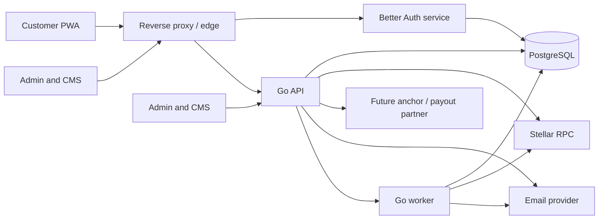
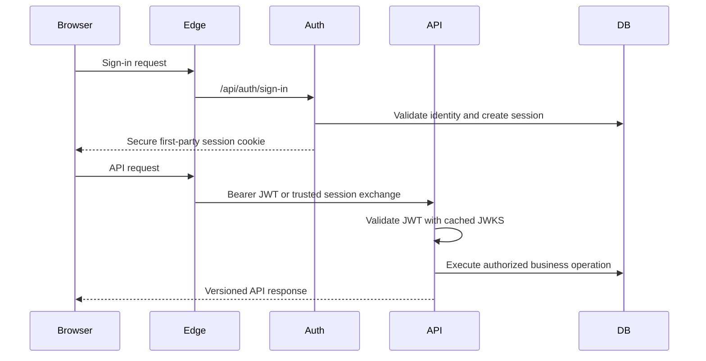

# Padalix System Architecture

## 1. Architecture Goal

Padalix should ship a credible Stellar testnet MVP quickly without pretending that the hackathon implementation is already a regulated remittance platform. The design must support a later controlled pilot without requiring the team to replace the entire application.

The initial system is a **modular monolith with separate deployable surfaces**:

- One responsive customer PWA.
- One back-office application for content and operations.
- One Better Auth service because Better Auth runs in TypeScript.
- One Go business API containing well-separated domain modules.
- One Go worker binary built from the same codebase as the API.
- One PostgreSQL cluster with schema-level ownership boundaries.
- One Soroban workspace for contracts.

Do not split the Go domains into networked microservices during the MVP. Internal Go packages give us clear ownership without adding distributed transactions, service discovery, and operational overhead.

## 2. System Context



All browser traffic should use a first-party Padalix origin. The edge routes `/api/auth/*` to Better Auth and `/api/v1/*` to Go. This avoids third-party-cookie behavior and keeps the frontend independent of internal service addresses.

## 3. Target Repository

```text
padalix/
├── apps/
│   ├── web/                    # Customer Next.js PWA
│   ├── admin/                  # Back-office Next.js application
│   └── marketing/              # Current public presentation site
├── services/
│   ├── auth/                   # Better Auth TypeScript service
│   └── platform/               # Go module
│       ├── cmd/api/
│       ├── cmd/worker/
│       ├── internal/
│       └── migrations/
├── contracts/
│   └── escrow/                 # Soroban Rust workspace
├── packages/
│   ├── ui/                     # Shared Padalix design system
│   ├── api-client/             # Generated TypeScript client
│   ├── contracts/              # Shared schemas and API artifacts
│   └── config/                 # Shared lint and TypeScript config
├── infrastructure/
│   ├── docker/
│   ├── compose.yaml
│   └── proxy/
├── docs/
└── Makefile
```

The current root landing page should be preserved and moved into `apps/marketing` during the foundation phase. It should not be rewritten while the transaction product is being established.

## 4. Technology Choices

| Area | Choice | Reason |
| --- | --- | --- |
| Customer PWA | Next.js App Router, React, TypeScript | Responsive web and installable PWA from one codebase |
| Admin | Next.js App Router, React, TypeScript | Shares UI and generated API contracts with the PWA |
| UI | Tailwind CSS, accessible headless primitives, Lucide | Fast, consistent implementation with keyboard support |
| Server data | TanStack Query | Explicit caching, retries, invalidation, and mutation states |
| Local UI state | Zustand only where URL and server state are insufficient | Avoid a large global store |
| Authentication | Better Auth in a standalone TypeScript service | Better Auth is a TypeScript framework and should not be ported into Go |
| Business API | Go, `net/http` with a small router, OpenAPI | Simple runtime, clear contracts, strong concurrency support |
| Database access | `pgx` and `sqlc` | Typed SQL while keeping financial queries explicit |
| Migrations | Versioned SQL owned by each service | Reviewable schema evolution and deterministic deployment |
| Database | PostgreSQL | Transactions, constraints, auditability, and mature operations |
| Background work | PostgreSQL outbox plus Go worker | Reliable MVP jobs without adding a queue platform immediately |
| Stellar | SDF-maintained Go SDK and Stellar RPC | RPC is the recommended interface for new Stellar applications |
| Smart contracts | Soroban Rust SDK | Native contract toolchain and test support |
| API documentation | OpenAPI generated from the Go contract | One API contract for PWA, admin, and tests |
| Local environment | Docker Compose | Reproducible PostgreSQL, mail sandbox, auth, API, and apps |

Redis, Kafka, NATS, Kubernetes, and independent domain microservices are intentionally excluded from the MVP. Add infrastructure only when a measured requirement appears.

## 5. Deployable Components

### 5.1 Customer PWA

The PWA owns presentation and user interaction only. It must not contain business rules that determine fees, eligibility, transfer status, or ledger results.

Core routes:

- `/` dashboard
- `/send` amount, quote, recipient, delivery, review, result
- `/receive` account and claim information
- `/recipients`
- `/activity/[transferId]`
- `/family`
- `/escrow`
- `/settings`

PWA rules:

- Cache application assets and public content only.
- Never queue financial mutations while offline.
- Disable send confirmation when connectivity cannot be verified.
- Display an explicit offline state instead of stale financial balances.
- Use responsive layouts, safe-area insets, keyboard navigation, and touch targets.
- Treat installation and push notifications as enhancements, not prerequisites.

### 5.2 Admin and CMS

The admin app is a back office, not a direct database editor. Every action goes through authenticated admin API endpoints and creates an audit event.

Initial capabilities:

- Manage FAQs, announcements, help articles, and legal-content versions.
- Configure feature flags, supported demo assets, fee display, and maintenance mode.
- Search users, recipients, transfers, claims, and escrow records.
- Inspect transaction state and Stellar references.
- Retry permitted background jobs through controlled commands.
- View immutable audit history.

Roles:

- `content_editor`
- `support_agent`
- `operations_agent`
- `compliance_reviewer` for post-MVP workflows
- `administrator`

No role receives unrestricted SQL access through the application.

### 5.3 Better Auth Service

The auth service owns only identity and authentication concerns:

- Registration and sign-in.
- Email verification and password reset.
- Session management.
- Administrative roles and account status.
- JWT issuance for the Go API.
- JWKS publication and signing-key rotation.

The Go API validates short-lived JWTs locally using cached JWKS. It checks issuer, audience, subject, expiry, and role claims. Sensitive operations may additionally require a fresh-session check against the auth service.

Better Auth tables live in the PostgreSQL `auth` schema, use a dedicated database role, and are migrated only by the auth service.

### 5.4 Go Platform API

The API is a modular monolith with these initial modules:

| Module | Owns |
| --- | --- |
| Identity profile | Padalix profile linked to Better Auth subject |
| Assets | Supported asset metadata and display precision |
| Wallets | Testnet account references and signer abstraction |
| Recipients | Saved recipients and delivery preferences |
| Quotes | Rate, fees, expiry, send amount, and receive amount |
| Transfers | Transfer lifecycle and orchestration |
| Ledger | Internal double-entry accounting records |
| Family | Distribution rules and resulting transfer legs |
| Claims | Claim code lifecycle and claimable-balance references |
| Escrow | Escrow state and Soroban invocation references |
| Content/config | Published CMS content and runtime feature configuration |
| Audit | Append-only security and administrative events |
| Compliance | Member KYC cases, evidence metadata, risk ratings, reviews, and decisions |
| Notifications | Member preferences and transactional delivery outbox |

Each module exposes application-level commands and queries. HTTP handlers may call those interfaces but must not perform SQL or Stellar calls directly.

The current back-office implementation proves the compliance workflow in the admin application. When the Go platform service is introduced, ownership of `identity`, `compliance`, and `notification` moves behind the Go API while the reviewer UI keeps the same contract. See [Notifications and Compliance Boundary](./NOTIFICATIONS_AND_COMPLIANCE.md).

### 5.5 Go Worker

The worker consumes jobs from the PostgreSQL outbox and performs retryable side effects:

- Persist submission outcomes and reconcile submitted Stellar transactions.
- Poll transaction results and reconcile status.
- Expire quotes and claim codes.
- Send transactional email.
- Retry recoverable operations.
- Raise records that require manual intervention.

Every job must have an idempotency key, bounded retry count, exponential backoff, and a terminal failure state. The API must never report a transfer as complete only because a job was accepted.

For the non-custodial wallet flow, customer-signed XDR is never persisted. The
API validates and submits it from request memory, then commits the submitted
state and durable reconciliation job atomically. An ambiguous RPC response is
retried by the customer with the same signed transaction; once RPC accepts it,
the worker owns restart-safe reconciliation, ledger posting, and notification.

### 5.6 Soroban Contracts

The MVP contract workspace contains one milestone escrow contract. It should remain narrow:

- Initialize an escrow with parties, asset, amount, and expiry.
- Fund the escrow.
- Release by authorized confirmation.
- Refund under explicit conditions.
- Emit events for reconciliation.

Avoid building family distribution into a contract during the MVP. Native Stellar multi-operation transactions or orchestrated transfer legs are easier to reason about and demo.

## 6. Authentication and Request Flow



Use secure, HTTP-only cookies for the browser session. The PWA must never store session tokens in `localStorage`. If the frontend obtains a short-lived service JWT, keep it in memory and renew it through the first-party auth route.

## 7. Money, Ledger, and Transfer Rules

Financial values must never use floating-point types.

- Store Stellar quantities with sufficient fixed precision, such as `NUMERIC(30,7)`.
- Store asset code, issuer, network, and display precision with every relevant record.
- Parse amounts with a decimal library in Go.
- Make quotes immutable after issuance and give them an expiry.
- Store the displayed rate, fee, source amount, and destination amount on the transfer.
- Require an idempotency key for transfer creation and confirmation.
- Keep an internal double-entry ledger even on testnet so reconciliation behavior is designed early.

Minimum ledger tables:

- `ledger_accounts`
- `ledger_transactions`
- `ledger_postings`

For every ledger transaction, postings must balance per asset. A database constraint or deferred validation function should prevent unbalanced entries from committing.

### Transfer state machine

```text
draft
  -> quoted
  -> awaiting_confirmation
  -> queued
  -> submitted
  -> confirmed
  -> available | claimed

Any non-terminal state may move to:
  -> failed
  -> expired
  -> requires_review
```

Transitions occur through named commands, not arbitrary status updates. Every transition records actor, time, reason, and correlation ID.

## 8. Core Data Model

The MVP needs these primary records:

- `profiles`
- `wallets`
- `assets`
- `recipients`
- `quotes`
- `transfers`
- `transfer_legs`
- `family_rules`
- `family_rule_members`
- `claims`
- `blockchain_transactions`
- `escrows`
- `ledger_accounts`
- `ledger_transactions`
- `ledger_postings`
- `outbox_events`
- `idempotency_keys`
- `content_entries`
- `feature_flags`
- `audit_events`

Use UUIDs or sortable UUID-compatible IDs internally. Public identifiers should be opaque and must not expose sequential database keys.

## 9. Stellar Boundary

All Stellar integration sits behind Go interfaces:

```text
QuoteProvider
AccountReader
TransactionBuilder
TransactionSubmitter
TransactionReconciler
WalletSigner
ClaimableBalanceGateway
EscrowGateway
```

MVP behavior:

- Use Stellar testnet only.
- Use test assets and label them clearly.
- Use Stellar RPC for live network interaction.
- Persist Padalix's own transaction history because RPC is not a long-term indexer.
- Use path payments only when a viable liquidity path exists.
- Provide a deterministic demo quote fallback that is labeled as simulated.
- Give claimable balances a Padalix recovery claimant and explicit expiry predicates.

### Signing decision

The MVP may use testnet-only managed accounts so the PWA works consistently on mobile and desktop. This is a demo custody model, not a production custody design.

- Put signing behind `WalletSigner` from day one.
- Encrypt testnet secrets with envelope encryption and keep the master key outside the database.
- Never send secret keys to the browser or write them to logs.
- Do not reuse the MVP key store on mainnet.

Before a controlled mainnet pilot, choose one production model with legal and security review: regulated custody partner, properly managed custodial HSM/KMS infrastructure, or a non-custodial/passkey account design.

## 10. PostgreSQL Ownership

One PostgreSQL cluster is sufficient initially, with separate roles and schemas:

| Schema | Owner | Contents |
| --- | --- | --- |
| `auth` | Auth database role | Better Auth users, sessions, accounts, JWKS |
| `core` | Go API role | Profiles, wallets, recipients, quotes, transfers |
| `ledger` | Go API role | Accounts, transactions, postings |
| `content` | Go API role | CMS content and feature configuration |
| `audit` | Restricted Go role | Append-only audit events |

The auth service cannot read ledger or transfer data. The Go service references the Better Auth user only by stable subject ID and must not update auth-owned tables.

## 11. API Standards

- Base path: `/api/v1`.
- JSON request and response contracts documented in OpenAPI.
- RFC 9457-style problem responses for errors.
- Cursor pagination for activity and admin search.
- `Idempotency-Key` required on money-moving commands.
- `X-Correlation-ID` accepted or generated for every request.
- Optimistic concurrency or version checks for mutable configuration.
- Webhook signatures and replay protection when partner integrations arrive.

Example resource groups:

```text
/api/v1/me
/api/v1/assets
/api/v1/wallets
/api/v1/recipients
/api/v1/quotes
/api/v1/transfers
/api/v1/family-rules
/api/v1/claims
/api/v1/escrows
/api/v1/admin/*
```

## 12. Security Baseline

MVP does not mean insecure. The first release requires:

- Secure cookies, origin checks, CSRF protection, and strict trusted origins.
- JWT issuer, audience, expiry, and signature validation.
- Rate limits on authentication, quotes, claims, and transfer confirmation.
- Field-level validation and server-side authorization on every command.
- Encryption in transit and encryption for secrets at rest.
- No wallet secrets, tokens, claim codes, or personal data in logs.
- Single-use, hashed claim codes with expiry and attempt limits.
- Immutable administrative audit events.
- Dependency and secret scanning in CI.
- Content Security Policy and standard browser security headers.
- Database backups and a tested restore procedure before staging is treated as durable.

KYC, AML, sanctions screening, transaction monitoring, fraud case management, and production custody controls are pilot requirements, not simulated production claims.

## 13. Observability

Use structured logs, metrics, and traces with a shared correlation ID.

Minimum signals:

- HTTP request count, latency, and error rate.
- Auth success, failure, lockout, and reset events.
- Quote creation and expiry.
- Transfer count by state and age.
- Outbox depth, retry count, and terminal failures.
- Stellar submission and confirmation latency.
- Ledger reconciliation failures.
- Admin actions and permission denials.

Never use logs as the financial source of truth. PostgreSQL records and Stellar transaction references are authoritative.

## 14. Environments

| Environment | Purpose | Stellar network |
| --- | --- | --- |
| Local | Development through Docker Compose | Testnet or local mocks |
| CI | Unit, integration, contract, and build verification | Mocks; isolated testnet tests only when necessary |
| Staging | Shared QA and product acceptance | Testnet |
| Demo | Stable judging and stakeholder environment | Testnet with controlled seeded data |
| Production | Added only after pilot readiness gate | Mainnet only after approval |

Staging and demo should not share databases or signing keys.

## 15. Architecture Decisions That Must Be Recorded

Before implementation, create short ADRs for:

1. Better Auth as a separate TypeScript service.
2. Go modular monolith plus worker process.
3. Testnet-only managed wallet model for MVP.
4. PostgreSQL outbox rather than a message broker.
5. Internal double-entry ledger from the MVP.
6. Stellar RPC as the primary network interface.
7. PWA offline policy prohibiting queued financial mutations.

## 16. Official References

- [Next.js PWA guide](https://nextjs.org/docs/app/guides/progressive-web-apps)
- [Better Auth JWT and JWKS](https://better-auth.com/docs/plugins/jwt)
- [Better Auth PostgreSQL adapter and schema isolation](https://better-auth.com/docs/adapters/postgresql)
- [Stellar API overview](https://developers.stellar.org/docs/data/apis)
- [Stellar Go SDK](https://developers.stellar.org/docs/tools/sdks/client-sdks)
- [Stellar path payments](https://developers.stellar.org/docs/build/guides/transactions/path-payments)
- [Stellar claimable balances](https://developers.stellar.org/docs/build/guides/transactions/claimable-balances)
- [Stellar Anchor Platform](https://developers.stellar.org/docs/platforms/anchor-platform)
