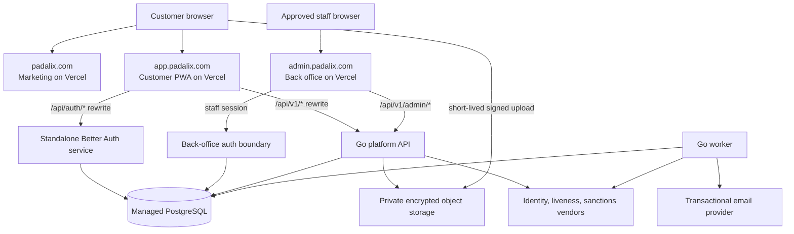

# Padalix Deployment Runbook

## 1. Production Topology

Padalix uses separate public surfaces while keeping authentication and business APIs behind first-party paths. The customer sees KYC as part of the main application, but identity documents never pass through the PWA deployment or become public assets.



| Surface | Production address | Deployment | Responsibility |
| --- | --- | --- | --- |
| Marketing | `https://padalix.com` and `https://www.padalix.com` | Vercel, `apps/marketing` | Public content, documentation, help entry point |
| Customer PWA | `https://app.padalix.com` | Separate Vercel project, `apps/web` | Account, payments, `/verification`, KYC status |
| Administrator | `https://admin.padalix.com` | Separate Vercel project, `apps/admin` | CMS, support, KYC review, operations |
| Customer auth | First-party path `https://app.padalix.com/api/auth/*` | Standalone TypeScript service behind a Vercel rewrite or edge proxy | Customer registration, verification, sessions, JWT/JWKS |
| Platform API | First-party path `https://app.padalix.com/api/v1/*` | Container platform with private networking | Go business rules, KYC policy, payments, signed uploads |
| Staff API | First-party path `https://admin.padalix.com/api/v1/admin/*` | Same Go API, separate route policy | Reviewer and administrator commands |
| Worker | No public address | Container worker on private network | Outbox jobs, email, vendor polling, reconciliation |

The Go API remains one modular monolith plus one worker for the MVP. Do not expose PostgreSQL, the worker, or object-storage administration endpoints to the public internet.

## 2. Trust Boundaries

### Public marketing

The marketing project can read published CMS content and submit public support requests. It receives no database credentials, KYC secrets, service tokens, or customer session. A failure or compromise of the marketing deployment must not grant access to member records.

### Customer application and standalone auth

The PWA proxies auth and platform requests through its own origin:

```text
app.padalix.com/api/auth/*  -> standalone Better Auth service
app.padalix.com/api/v1/*    -> Go platform API
```

This keeps the browser on `app.padalix.com`, avoids cross-site cookies, and prevents internal service addresses from becoming frontend configuration. Configure the auth service's external/base URL as `https://app.padalix.com/api/auth`, even when its runtime has a different private or origin address.

Use a host-only cookie such as `__Host-padalix_session` with `Secure`, `HttpOnly`, `Path=/`, and `SameSite=Lax`. Do not set `Domain=.padalix.com`: customer cookies must never be sent to marketing or admin. Do not store bearer or refresh tokens in `localStorage`. Mutating cookie-authenticated routes require CSRF/origin validation against exactly `https://app.padalix.com`.

The standalone auth service owns customer registration. It issues short-lived, audience-bound JWTs for the Go API and publishes JWKS. The API validates signature, issuer, audience, subject, expiry, not-before time, and account status. Rotate signing keys with an overlap period longer than the maximum token lifetime.

### Administrator boundary

Staff identity is separate from customer membership. The current administrator app owns a Better Auth back-office tenant; preserve that separation when customer auth is extracted. Use a different cookie name, auth secret, signing keys, and allowed origins. A member account never becomes a reviewer by changing customer profile data.

`admin.padalix.com` should be protected by identity-aware access controls where practical, but network access control does not replace application authorization. Enforce `support_agent`, `compliance_reviewer`, `content_editor`, `operations_agent`, and `administrator` permissions in every API handler. Require MFA and recent authentication for reviewer provisioning, KYC decisions, limit overrides, and payment interventions.

### KYC inside the main app

Place customer routes such as `/verification`, `/verification/status`, and `/settings/limits` in `app.padalix.com`. These routes display KYC state and collect consent, but the server is authoritative for tier and entitlements.

Document flow:

1. The PWA requests an upload intent from `POST /api/v1/kyc/uploads`.
2. The Go API validates session, country, document type, file limits, and current case state.
3. The API returns a single-use, short-lived signed upload URL and opaque object key.
4. The browser uploads directly to private object storage over TLS.
5. The PWA confirms the upload with object key, size, media type, and checksum. It never submits a filesystem path or public URL.
6. The worker performs malware scanning and sends the evidence to the configured verification vendor.
7. Machine results update risk signals; deterministic policy decides `auto_approved`, `manual_review`, or `rejected` where legally permitted.
8. A reviewer requests evidence through the admin API. The API verifies role and case assignment, records the access event, and returns a download URL lasting only a few minutes.

Storage requirements:

- Block all public access and bucket listing.
- Use provider-managed encryption initially; use customer-managed KMS keys before a regulated pilot.
- Separate production, staging, and local buckets and encryption keys.
- Use opaque object keys without names, email addresses, document numbers, or countries.
- Restrict upload content type and size, verify checksum, and scan before reviewer access.
- Apply jurisdiction-approved retention and deletion policies; legal hold must be explicit.
- Record every upload, read, export, and deletion in append-only audit storage.
- Never put identity documents in Vercel Blob public stores, Next.js `public/`, PostgreSQL byte columns, logs, analytics, or support tickets.

The Go policy engine, not the PWA, controls features. A basic account may access permitted non-regulated functions; verified tiers unlock higher limits or additional actions. Every money-moving command re-evaluates KYC tier, country/corridor policy, sanctions status, account restrictions, velocity, and transaction limits. UI hiding is only presentation, never authorization.

## 3. DNS and TLS

Create these DNS records after each platform provides its verification target:

| Host | Record | Target |
| --- | --- | --- |
| `padalix.com` | Vercel apex record | Value displayed by the marketing Vercel project |
| `www.padalix.com` | `CNAME` | Vercel marketing target; redirect to apex |
| `app.padalix.com` | `CNAME` | Customer PWA Vercel project target |
| `admin.padalix.com` | `CNAME` | Administrator Vercel project target |
| Auth/API origins | Provider-specific or private DNS | Do not advertise these as customer entry points |

Let Vercel and the container provider issue and renew TLS certificates. Enable HSTS only after every production subdomain is HTTPS-ready; begin without `includeSubDomains`, then add it after validation. Do not point staging records at production services.

Recommended non-production names are `staging.padalix.com`, `app.staging.padalix.com`, and `admin.staging.padalix.com`, each backed by separate databases, buckets, OAuth credentials, signing keys, and email suppression rules.

## 4. Vercel Projects

Create three independent projects from the same repository:

| Project | Root directory | Domain | Notes |
| --- | --- | --- | --- |
| Marketing | `apps/marketing` | `padalix.com` | Existing deployable |
| Customer | `apps/web` | `app.padalix.com` | PWA and first-party API rewrites |
| Admin | `apps/admin` | `admin.padalix.com` | Existing deployable; no public sign-up |

For each project, select the matching root directory, use `pnpm`, and keep preview and production variables separate. Protect preview deployments because preview URLs can otherwise call staging services from uncontrolled origins. Production secrets belong in Vercel encrypted environment variables, never in `NEXT_PUBLIC_*` values or committed `.env` files.

Customer rewrites must forward only the expected path prefixes to fixed upstreams. Do not implement a user-controlled generic proxy. Preserve request correlation IDs and the original host/protocol headers required by auth, while stripping spoofable identity headers at the edge.

The admin deployment may continue using its current server routes during the MVP. As the Go platform is introduced, migrate compliance, notification, and payment ownership behind `/api/v1/admin/*`; the admin remains a UI and back-office auth boundary rather than a direct database console.

## 5. Environment Variables

Values shown here are names and expected scope, not secrets.

### Marketing Vercel project

```dotenv
NEXT_PUBLIC_APP_URL=https://app.padalix.com
CMS_CONTENT_URL=https://admin.padalix.com/api/content/published
NEXT_PUBLIC_SUPPORT_API_URL=https://admin.padalix.com/api/support/tickets
STATUS_API_URL=https://admin.padalix.com/api/status
```

Only published CMS and public support endpoints may be reached from marketing. Restrict support CORS to the exact marketing origins.

### Customer PWA Vercel project

```dotenv
AUTH_ORIGIN_URL=https://<customer-auth-runtime-origin>
PLATFORM_API_ORIGIN_URL=https://<go-api-runtime-origin>
PLATFORM_INTERNAL_TOKEN=<pwa-to-platform-service-token>
KYC_INGEST_URL=https://admin.padalix.com/api/internal/kyc/cases
KYC_INGEST_SECRET=<temporary-integration-secret-during-migration>
DATABASE_URL=postgresql://<customer-auth-role>:<secret>@<pooler>/<database>?sslmode=require
BETTER_AUTH_SECRET=<customer-auth-secret>
BETTER_AUTH_URL=https://app.padalix.com
BETTER_AUTH_TRUSTED_ORIGINS=https://app.padalix.com
NEXT_PUBLIC_APP_ORIGIN=https://app.padalix.com
NEXT_PUBLIC_MARKETING_URL=https://padalix.com
```

`PLATFORM_API_ORIGIN_URL`, `PLATFORM_INTERNAL_TOKEN`, `KYC_INGEST_URL`, `KYC_INGEST_SECRET`, `DATABASE_URL`, and Better Auth secrets are server-only configuration. The ingestion secret must match the administrator project, must never use the `NEXT_PUBLIC_` prefix, and should be replaced by service identity when the Go platform API takes ownership of KYC. Customer authentication currently runs in the PWA Next.js runtime with tables isolated in `customer_auth`; it can move to the documented standalone auth deployment without changing browser routes.

### Administrator Vercel project

```dotenv
DATABASE_URL=postgresql://<admin-runtime-role>:<secret>@<pooler>/<database>?sslmode=require
BETTER_AUTH_SECRET=<staff-auth-secret>
BETTER_AUTH_URL=https://admin.padalix.com
BETTER_AUTH_TRUSTED_ORIGINS=https://admin.padalix.com
BETTER_AUTH_ALLOW_SIGNUP=false
SUPPORT_ALLOWED_ORIGINS=https://padalix.com,https://www.padalix.com
SUPPORT_TOKEN_PEPPER=<independent-random-secret>
KYC_INGEST_SECRET=<temporary-integration-secret-during-migration>
KYC_REVIEW_EMAIL=compliance@padalix.com
KYC_AUTO_APPROVAL_ENABLED=false
NEXT_PUBLIC_MARKETING_URL=https://padalix.com
CRON_SECRET=<independent-status-monitor-secret>
```

Use the managed PostgreSQL pooler for Vercel functions and cap pool size appropriately. Replace the shared `KYC_INGEST_SECRET` with short-lived service identity or signed requests when the Go API owns KYC ingestion.

`CRON_SECRET` protects the one-minute `/api/cron/status` probe. Vercel sends it as a bearer token for scheduled invocations. The status monitor accepts only HTTPS targets on `padalix.com` subdomains, uses an advisory lock to prevent overlapping runs, opens a public incident after three consecutive failures, and resolves only after two consecutive successful checks. This schedule requires Vercel Pro or Enterprise. `STATUS_API_URL` is server-only in marketing; the incident banner is streamed so a slow or unavailable status feed never delays the page body.

### Standalone auth service

```dotenv
DATABASE_URL=postgresql://<auth-role>:<secret>@<private-db-host>/<database>?sslmode=require
BETTER_AUTH_SECRET=<customer-auth-secret>
BETTER_AUTH_URL=https://app.padalix.com/api/auth
BETTER_AUTH_TRUSTED_ORIGINS=https://app.padalix.com
JWT_ISSUER=https://app.padalix.com/api/auth
JWT_AUDIENCE=padalix-platform-api
EMAIL_FROM=security@padalix.com
EMAIL_OUTBOX_MODE=database
```

### Go API and worker

```dotenv
DATABASE_URL=postgresql://<platform-role>:<secret>@<private-db-host>/<database>?sslmode=require
PLATFORM_INTERNAL_TOKEN=<matching-pwa-to-platform-service-token>
AUTH_JWKS_URL=https://<auth-runtime-origin>/.well-known/jwks.json
AUTH_ISSUER=https://app.padalix.com/api/auth
AUTH_AUDIENCE=padalix-platform-api
APP_ORIGIN=https://app.padalix.com
ADMIN_ORIGIN=https://admin.padalix.com
OBJECT_BUCKET=<private-production-bucket>
OBJECT_REGION=<region>
OBJECT_KMS_KEY_ID=<kms-key-reference>
OBJECT_UPLOAD_TTL_SECONDS=300
OBJECT_REVIEW_TTL_SECONDS=180
EMAIL_PROVIDER=ses
EMAIL_FROM=notifications@padalix.com
EMAIL_DELIVERY_ENABLED=false
AWS_REGION=ap-southeast-1
AWS_ACCESS_KEY_ID=<ses-send-only-access-key>
AWS_SECRET_ACCESS_KEY=<ses-send-only-secret-key>
EMAIL_SES_CONFIGURATION_SET=<optional-configuration-set>
WORKER_ID=<unique-runtime-instance-id>
WORKER_POLL_INTERVAL=2s
WORKER_LOCK_TIMEOUT=2m
KYC_VENDOR=<provider>
KYC_WEBHOOK_SECRET=<vendor-specific-secret>
```

For SES, verify the sending domain with DKIM, configure SPF and DMARC, request
production access in the selected AWS region, and route bounce/complaint events
to an operator-owned destination. Keep `EMAIL_DELIVERY_ENABLED=false` until a
mailbox-simulator smoke test and one controlled real-recipient test pass.

Give the API permission to create narrowly scoped signed URLs, not to administer buckets. Give the worker only the object-read and quarantine/delete permissions its jobs require. Store cloud credentials, vendor secrets, JWT signing material, database passwords, and email API keys in the runtime secret manager. Rotate independently and document owners and expiry dates.

Public marketing media uses the separate `padalix-media` R2 bucket. Configure
`NEXT_PUBLIC_MEDIA_URL=https://cdn.padalix.com` in marketing and the server-only
`MEDIA_S3_*` plus `MEDIA_PUBLIC_URL` variables in admin. Bootstrap the existing
assets before setting `NEXT_PUBLIC_MEDIA_CDN_ENABLED=true` by following
`PUBLIC_MEDIA_STORAGE.md`.

## 6. CORS, Cookies, and Proxy Rules

Prefer same-origin proxying over CORS for authenticated customer and admin APIs. If direct cross-origin calls are temporarily unavoidable:

- Allow exact origins only; never reflect arbitrary origins.
- Never combine `Access-Control-Allow-Origin: *` with credentials.
- Allow only required methods and headers.
- Set a short preflight cache while changing policies.
- Reject missing or unexpected `Origin` on browser mutation endpoints.
- Keep vendor webhooks outside browser CORS paths and authenticate signatures over raw request bytes.

Cookies are host-only. Customer and staff cookies use distinct names and secrets. The API must ignore client-supplied role, member ID, KYC tier, reviewer assignment, and verified status headers. Identity comes only from a validated session or JWT.

At the proxy, apply request-size limits before application parsing. KYC binaries use signed direct uploads, so auth and API routes can retain small JSON limits. Apply rate limits to registration, sign-in, recovery, upload-intent creation, verification resubmission, quote creation, payment confirmation, support creation, and administrator decisions.

## 7. PostgreSQL and Object Ownership

Use one managed PostgreSQL cluster initially with separate database roles and schema grants:

| Runtime role | Schemas | Prohibited access |
| --- | --- | --- |
| Customer auth | `auth` | Compliance documents, ledger, staff auth |
| Staff auth/admin | Back-office auth, `content`, `support` during transition | Ledger writes, customer secrets |
| Go platform | `identity`, `compliance`, `notification`, `core`, `ledger` | Auth credential mutation |
| Worker | Outbox claim/update plus required domain reads | Arbitrary admin and auth writes |
| Migrator | Migration-time ownership only | No application runtime use |

Require TLS, automated point-in-time recovery, encrypted backups, deletion protection, and tested restore procedures. Production migrations run as a release step with a migration role, not automatically from every serverless instance. Revoke broad `public` schema creation privileges and never use the PostgreSQL owner/superuser as an application credential.

Keep only document metadata, vendor references, checksums, classification, and opaque object keys in PostgreSQL. Document bytes stay in private object storage. Backups and replicas inherit the same personal-data classification and retention requirements.

## 8. Email and Notification Outbox

Business transactions insert notification outbox rows in the same PostgreSQL transaction as the state change. The Go worker claims pending rows with `FOR UPDATE SKIP LOCKED`, renders a versioned template, calls the provider, and records provider ID, attempts, next-attempt time, sent time, or terminal failure.

Use an idempotency key per notification and never treat provider acceptance as proof of user delivery. Alert on queue age, repeated failures, bounce rate, and complaint rate. Configure SPF, DKIM, and DMARC for the sending subdomain. Keep transactional/security mail separate from optional marketing mail and honor member preference only where the notification class permits opt-out.

KYC emails may say that verification requires action or has changed status. They must not include document images, document numbers, biometric results, private reviewer notes, or signed storage URLs.

## 9. Secrets and Operational Security

- Generate independent secrets for customer auth, staff auth, support tokens, vendor webhooks, and each environment.
- Keep secrets in Vercel or the container platform secret manager; commit only `.env.example` files.
- Do not use personal access tokens as permanent service credentials.
- Grant GitHub and deployment integrations least privilege and protect the production environment with approval gates.
- Enable secret scanning, dependency scanning, branch protection, required CI, and immutable build logs with redaction.
- Redact authorization headers, cookies, document metadata, email addresses, KYC decisions, claim codes, and payment details from logs.
- Carry a generated `X-Correlation-ID` through Vercel, auth, Go API, worker, and vendor requests without using it as authorization.
- Audit staff sign-in, document access, assignment, decision, policy override, export, and reviewer provisioning.

## 10. Deployment Order

1. Provision production and staging PostgreSQL, private object storage, KMS, email domain, container runtime, monitoring, and secret managers.
2. Create database roles and schemas, apply reviewed migrations with the migrator role, seed only non-sensitive configuration, and test backup restore.
3. Deploy the standalone auth service with customer registration disabled; verify health, email outbox, JWKS, signing-key rotation, origin checks, and database grants.
4. Deploy the Go API with financial and KYC mutations feature-disabled; verify database connectivity, JWKS validation, signed-upload scope, vendor signature checks, and health endpoints.
5. Deploy the Go worker with sending and vendor jobs initially paused; verify outbox claiming, idempotency, retry limits, and dead-letter alerts using synthetic records.
6. Deploy the administrator Vercel project, keep bootstrap sign-up disabled, create staff through a controlled process, require MFA, and test role isolation and document-access auditing.
7. Deploy the marketing Vercel project and validate published CMS reads, support origin restrictions, security headers, canonical redirects, and no customer cookies.
8. Deploy the customer PWA Vercel project with fixed auth/API rewrites. Test registration, session renewal, CSRF rejection, logout, basic-tier entitlements, signed upload, verification status, and denial of privileged payment actions.
9. Enable worker email in staging, then production with recipient safeguards. Enable verification vendor calls after webhook replay and failure tests pass.
10. Switch DNS with a low initial TTL, run smoke tests from mobile and desktop, monitor errors/outbox depth, then gradually enable KYC and payment features through server-side flags.

Rollback application deployments independently. Never roll back a destructive database migration; use forward-compatible expand/migrate/contract changes. Disable risky commands with server-side feature flags before rollback when schema or worker behavior has changed.

## 11. Production Readiness Gate

Before handling real identity documents or funds, confirm:

- A qualified legal/compliance owner has approved supported countries, document types, retention, consent, and KYC tier rules.
- The verification vendor supports required documents, liveness, sanctions/PEP screening, webhook signing, regional processing, and deletion.
- Machine decisions have documented thresholds, versioned models/rules, reason codes, bias/quality monitoring, and a manual appeal path.
- Auto-approval is disabled for unsupported documents, conflicting identity data, vendor uncertainty, sanctions/PEP matches, duplicate identities, tampering, or elevated risk.
- Basic-tier and verified-tier permissions are enforced by API policy tests for every command, not only by frontend navigation.
- MFA, least privilege, access reviews, document-view auditing, incident response, breach notification, and staff offboarding have been tested.
- Database restore, object deletion, key rotation, email retry, vendor outage, and deployment rollback drills have succeeded.
- Production custody, settlement, safeguarding, reconciliation, transaction monitoring, dispute handling, and payment licensing have passed separate legal and security review.

This topology is suitable for building and testing a professional MVP. It is not by itself authorization to operate a regulated remittance service or payment gateway.
